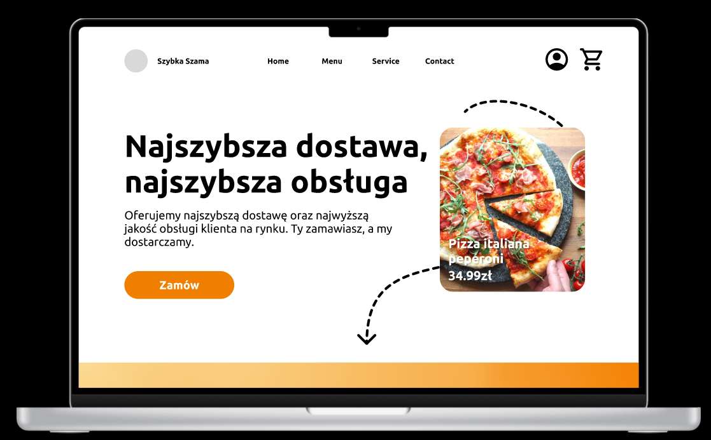

# szybka-szama

## Opis

Szybka szama to aplikacja do zamawiania jedzenia, stworzona przez łakomczuchów dla łakomczuchów!
Nie ważne czy to impreza ze znajomymi czy spotkanie biznesowe, a może po prostu posiłek spędzony we własnym towarzystwie, dostarczymy jedzenie na każdą okazję.

Aplikacja Szybka szama to platforma do zamawiania jedzenia, która umożliwia użytkownikom przeglądanie menu, składanie zamówień i śledzenie ich statusu. Ta dokumentacja zawiera informacje dotyczące instalacji, konfiguracji i korzystania z aplikacji Storz.

## Cechy

- Zamawianie jedzenia z setek restauracji
- Podgląd opinii innych użytkowników
- Różnorodność dań do wyboru
- informacje o alergenach
- nowoczesny design
- szybkość i łatwość obsługi

## Wymagania systemowe
- Przeglądarka internetowa z włączoną obsługą JavaScript

## Instalacja
TBD

## Specyfikacja

https://docs.google.com/document/d/1leKsiAFoEqqSoBuFQ-jD4u1dZcyqYBh5/edit?usp=sharing&ouid=108820201469184663417&rtpof=true&sd=true
## Autorzy
Autorami aplikacji są Jakub Markiewicz, Maks Sędkiewicz, Nikita Vinohradov i Kamil Wojtek
